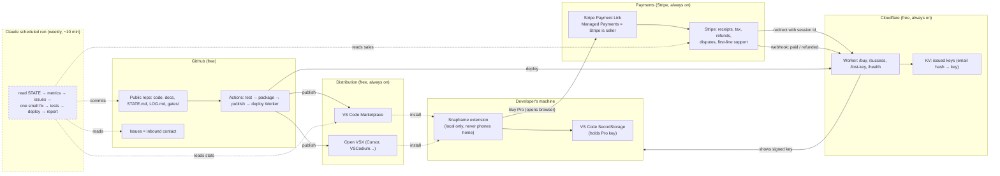

# 02 — Design (Phase 2) · Gate 1

**Prepared:** Friday 11 September 2026 (Sydney) · **Operator:** Hayden · **Status:** STOPPED at Gate 1, awaiting your approval.

> **If you read nothing else:** The product is a VS Code extension that turns a snippet of code into a good-looking image for sharing (the kind you see in tweets, docs and slides). The category has about 7 million lifetime installs and every leading extension in it has been abandoned for years with well-documented bugs. Free tier does the whole job, no ads, no nagging. A one-off US$9 "Pro" key unlocks extras. Stripe sells it and handles receipts, refunds and tax; a tiny free Cloudflare service hands out keys; the extension itself never phones home. Honest expectation stays what it was at Gate 0: a one-in-four chance of anything, low tens of dollars a month if it works. Section 12 tells you how to reply.

---

## 1. The offer

**A VS Code extension named "Snapframe — Code Screenshot" that turns selected code into a polished, theme-accurate PNG in one keystroke for free, and sells a one-off US$9 Pro key for vector/SVG export, presets, annotations and multi-snippet layouts — to developers who share code on social media, in docs, slides and pull requests, and who currently rely on abandoned tools that mangle fonts and indentation.**

### Why this product (evidence, not taste)

I pulled live data from the marketplace for 210 search phrases (full table in `02-research-notes.md`). The "code screenshot" shelf stood out on every axis that matters for a zero-marketing launch:

- **Demand exists and is concentrated.** CodeSnap (3.93M installs), Polacode (1.80M), Snapcode (313k), Polacode-2025 (286k) and Code Snapshot (276k) — about 7M installs on one interchangeable shelf.
- **Every leader is abandoned.** CodeSnap last updated July 2021 with 98 open issues; Polacode last updated 2019 and rated 3.18 with 23 of its last 40 reviews at three stars or below ("Doesn't work on Windows 11 either"); Snapcode 2020, rated 3.0. The only maintained entrant is a small fork. Reviews name the same fixable defects: wrong fonts, broken indentation, PNG-only, "copy to clipboard copies text not an image".
- **Zero privacy exposure.** The input is code the user chose to share. No files are read without an explicit action, nothing leaves the machine.
- **Small, self-contained build.** No language server, no database, no third-party API at runtime. A webview renders the snippet using VS Code's own "copy with syntax highlighting" so the theme and font are exactly what the user sees.
- **A one-off price has precedent.** Turbo Console Log sells one-off Pro bundles at US$29.99+; screenshot beautifiers outside VS Code (Xnapper) sell at US$29.99. US$9 sits deliberately below both: this is a convenience, not a workflow dependency, so it is priced as an impulse.

Runner-up was XML/XPath tooling (same abandoned-leader pattern, smaller and slower demand). Rejected niches and why are in the research notes.

### Free vs Pro (the rule: Pro is strictly additive; the free tier must beat CodeSnap outright)

Every documented backlash against paid VS Code extensions came from taking something away — read-only free tiers, banners, login walls, "sponsored content". Snapframe never does that.

| Free (forever, no watermark, no ads, no account) | Pro (one-off US$9 key) |
|---|---|
| Capture selection or whole file with the user's actual theme, font and ligatures | SVG (vector), PDF and WebP export; transparent backgrounds; 3×/4× scale |
| Correct de-indentation and soft-wrap (the top two CodeSnap complaints) | Named presets, saved and shareable as JSON |
| Window chrome, padding, background colour, shadow, rounded corners, optional line numbers and title bar | Custom gradients/background images, brand colour, the user's own caption or handle |
| Export PNG to file **and copy the image to the clipboard**, 1× and 2× | Line highlighting, focus-dim ranges, inline annotations and callouts |
| One-command "quick snap" with last settings; keyboard shortcut | Before/after and side-by-side layouts; terminal-selection capture |
| Works in VS Code, Cursor, Windsurf, VSCodium (published on both marketplaces) | Batch export of all selections / open editors; "copy as Markdown image link" |

### Name and identity

Publisher and brand: **Snapframe** (display name "Snapframe — Code Screenshot", so the exact search phrase is in the name; observed marketplace behaviour ranks name matches first). Fallbacks if the name is taken at publisher creation: **Framecode**, **Snipframe**. I will check availability before asking you to create the publisher (Gate 3) and will not ask you to pick.

Your name appears only on the Stripe account. Customers see "Snapframe" and, on receipts, "Sold through Link" (Stripe's entity). The README will state plainly that Snapframe is built and maintained largely by an AI agent under human ownership — an honest sentence that costs nothing and pre-empts the one question a sceptical developer would ask. You can veto that line at this gate.

---

## 2. Architecture

Everything runs on free tiers with no inactivity pausing (verified 11 Sep 2026). Solid boxes run continuously without me; dashed boxes only run when I do.

### How a purchase works, step by step

1. In the extension, "Snapframe: Buy Pro" opens the Stripe Payment Link in the browser. Checkout happens on Stripe's page (card details never touch anything of ours — this also keeps us inside Cloudflare's free-plan rule against handling card data).
2. Stripe (as merchant of record) takes payment, works out GST/VAT for the buyer's country, and emails the receipt.
3. Stripe redirects the buyer to `/success?session=…` on the Cloudflare Worker. The Worker asks Stripe (with a read-only restricted key) whether that session is paid, then mints a licence key: a short string signed with an Ed25519 private key that lives only in the Worker's secrets. The key encodes product, issue date and a hash of the buyer's email. It's stored in KV and shown on the page with one line: "Paste this into VS Code → Snapframe: Enter Licence Key. Bookmark this page; it always shows your key."
4. Stripe also sends a `checkout.session.completed` webhook to the Worker, which mints the same key if the buyer closed the tab early. The webhook is the source of truth; the success page is convenience.
5. The extension verifies the signature **offline** with the public key baked into the extension. No server call, ever, after purchase. Keys work with no internet and keep working if Cloudflare or I disappear.
6. Lost key: `/lost-key` asks for the purchase email plus the last four digits of the card; the Worker checks both against Stripe and re-shows the key. Rate-limited. No email sending needed (which would require a domain we don't have).
7. Refunds: Stripe/Link handles the request. On `charge.refunded`, the Worker marks the key revoked in KV so it can't be re-issued via lost-key. Already-activated keys keep working offline — the same trade-off SQLite Viewer sells as a feature. A US$9 product does not justify phone-home enforcement.

### Stack (all free tiers, all verified)

| Piece | Choice | Why |
|---|---|---|
| Extension | TypeScript, VS Code API, webview rendering via `clipboardCopyWithSyntaxHighlightingAction`, SVG as source of truth, rasterised to PNG in the webview | Theme-exact output; SVG makes pixel-diff testing possible without eyeballs |
| Key verification | Node `crypto.verify` Ed25519 (extension host is Node 22) | Offline, 32-byte public key embedded, no dependency |
| Payments | Stripe Managed Payments via Payment Link, one-time, tax code "Downloadable Software" (`txcd_10202000`, eligible), price US$9 with Adaptive Pricing | Stripe is legal seller; AU payouts free, 2 business days; no custom domain needed |
| Key issuance | Cloudflare Worker + KV (free: 100k requests/day, 1k KV writes/day) | No pausing; 1k writes/day is thousands of sales beyond any realistic volume |
| Distribution | VS Code Marketplace (publisher "snapframe") + Open VSX | Free; CI publishing officially supported; Open VSX allows licence-gated proprietary extensions |
| Source | Public GitHub repo, source-available licence (not open source) | Public Issues = free inbound contact; free unlimited Actions minutes. Anyone can read the Pro gate; people who'd strip it wouldn't have paid |
| CI | GitHub Actions: lint, unit tests, golden-image tests (headless Chromium), package, publish, deploy | Blocks publish on red |
| Agent runtime | Claude scheduled task (cloud), GitHub access via Claude's GitHub App authorisation | No token pasted anywhere by you |

### Fallbacks decided now

- If Stripe's Managed Payments eligibility review declines an individual account → **Polar.sh** (5% + 50¢, Australia supported, native licence keys, ID + selfie via Stripe). Same success-page flow. Gate 4 re-issues.
- If Microsoft's new token-free publishing (OIDC "trusted publishing") isn't available in the publisher portal when we get there → a classic publishing token stored in GitHub Actions secrets (not chat), replaced before its 1 December 2026 retirement. Both paths documented in the gate file.
- If the golden-image tests can't be made reliable across fonts → ship SVG export as the reference and PNG as "best effort", and say so in the README.

---

## 3. Inbound contact

Every channel a customer can use lands somewhere the weekly run can read with the access it already has:

| Channel | Who reads it | What happens |
|---|---|---|
| **GitHub Issues** on the public repo (linked from the extension, README, marketplace page, success page) | Weekly run | Bugs, feature requests, "how do I". Templates route them. |
| **Marketplace Q&A and reviews** | Weekly run (public pages, no login needed to read) | Replies posted on the next run where a login is available; otherwise answered via a README FAQ update. |
| **Stripe / Link support** (refunds, "didn't get a key", disputes) | Stripe first; escalations go to your support email | Link resolves most itself. If Stripe emails you and nobody answers within 48 hours, Stripe may refund automatically — which is exactly our policy anyway. |
| **Your support email** (Stripe requires one; it will be the address in the Operator Config unless you'd rather create a free alias) | You, at most a glance | Anything that lands there is either a Stripe escalation (ignore = auto-refund) or spam. The weekly report will remind you if a gate-worthy email is likely pending. |

No mailbox I can't read is load-bearing. The `/lost-key` page removes the single most common support request ("I lost my key") without a human.

---

## 4. Automation map

| Recurring task | Who | How often | Notes |
|---|---|---|---|
| Serve the product (install, run, render, verify keys) | VS Code + the user's machine | Continuous | Nothing of ours is in the loop |
| Take payments, tax, receipts, refunds, disputes | Stripe (merchant of record) | Continuous | Stripe's obligation, not ours |
| Issue keys on purchase; lost-key lookups | Cloudflare Worker | Continuous | Stateless except KV; no cron needed |
| Build, test, package, publish to both marketplaces, deploy Worker | GitHub Actions | On every merge to `main` | Red tests block publish |
| Read metrics, triage issues, ship one small improvement | Me (scheduled run) | Daily for the first 4 stable weeks, then weekly | 10-minute budget, one deploy max |
| Reply to reviews/Q&A | Me | Weekly | Only where a login is available; never argue |
| Dependency updates | GitHub Dependabot → me | Weekly batch | Patch/minor auto-merge on green; majors are a considered change |
| Reconcile Stripe payments vs. issued keys | Me | Weekly | Any paid session without a key → mint it, log it |
| Weekly report `reports/YYYY-WW.md` + notification | Me | Sunday, Sydney time | Under 200 words, ends with keep / watch / pivot / kill |
| Read the report; answer at most one question | **You** | Weekly, ≤ 5 min | The only recurring human task |
| Accountant conversation when money first arrives | **You** | Once | I'll flag it; not a gate for me |

---

## 5. Support policy (no human in the loop)

- **Refunds:** 14 days, no questions asked, for any reason, via Stripe/Link. Beyond 14 days, Stripe's own consumer-protection rules apply and Stripe decides. We never contest a chargeback on a US$9 sale — a dispute costs more than the sale.
- **Template replies** (posted as README FAQ entries and issue-template auto-comments) for the top five questions: "Where's my key?", "Fonts look wrong", "How do I use it in Cursor?", "Can I use my key on two machines?" (yes, three), "Do you collect anything?" (no — and here's the `telemetry.json` proving the extension declares none).
- **Bugs:** triaged on the weekly run; reproducible crashes and wrong-output bugs go first; feature requests are labelled and batched. One fix per run.
- **Anything else** waits for the weekly run. Nobody is promised a response time faster than a week; the README says so plainly.
- **Rude or abusive issues** are locked, not answered.

---

## 6. Monitoring and self-healing

| What | How | Automatic response | Escalate when |
|---|---|---|---|
| Worker alive and keys verifiable | `/health` mints a test key and verifies it; checked by every scheduled run and by Better Stack's free 3-minute monitor (email alert to you only as a dead-man's switch) | Redeploy last green build; if still failing, `/success` page falls back to "your key will be emailed by our next run — reply to your Stripe receipt if not" | Two consecutive runs failing |
| Paid but no key issued | Weekly reconciliation of Stripe `checkout.session.completed` events against KV | Mint and log the missing key | Never — it's fixed automatically |
| Publish/deploy pipeline | GitHub Actions status | Roll back to previous version tag; open an issue against myself | Same failure three runs running |
| Ratings trend | Marketplace stats via the public query API | Weekly report line | Rating drops below 4.0 with ≥10 ratings |
| Dependency vulnerabilities | Dependabot alerts | Patch on next run if tests pass | Critical with no fix available |
| Kill switch | `STOP` file in repo root | Every run exits immediately; product and payments continue untouched | — |
| Runaway guard | 10-minute run budget; one deploy per run; never retry money-touching actions | Commit what's safe, stop | — |

Deliberately **not** monitored: user telemetry. The extension declares none and sends none. Install and rating numbers come from the marketplace's public statistics.

---

## 7. The five most likely ways this dies, and the pre-decided response

1. **Rendering isn't reliably right** (ligature fonts, emoji, CJK, wrapped lines) and reviews say so. → SVG is the source of truth with a golden-image test suite run in headless Chromium in CI; the weekly run compares pixel diffs against stored references. If a class of bug can't be fixed in three runs, the README documents the limitation and Pro export for that case is disabled rather than sold broken.
2. **Installs come, sales don't.** → After 90 days with ≥1,000 installs and <5 sales, run one price test (US$5 for 30 days) and one packaging test (move presets to free, keep SVG/annotations Pro). If neither moves sales, proceed to the sunset criteria — not to more features.
3. **Stripe declines Managed Payments for an individual.** → Polar.sh fallback, pre-decided (Section 2). If Polar also declines, the extension ships fully free and the stream is killed with a clear report; no third rail.
4. **Publishing breaks** (token retirement on 1 Dec 2026, marketplace policy change, publisher verification). → Existing installs keep working; a gate file with the exact fix goes to you; the product is fine unattended for months without an update.
5. **My scheduled runs stop** (subscription lapses, scheduler breaks). → Nothing customer-facing depends on me. Stripe keeps selling, the Worker keeps issuing keys, the extension keeps working. The only thing that stops is improvement and issue triage; the README's "response within a week" promise is the sole casualty.

Sixth, for completeness: **CodeSnap gets revived.** A maintained 3.9M-install incumbent would cap growth hard. Response: nothing — we'd still be the only one with vector export and presets, and it changes the verdict from "watch" to "kill" sooner, not later.

---

## 8. Metrics that matter (five, with thresholds)

| # | Metric | Source | "Pivot" | "Kill" |
|---|---|---|---|---|
| 1 | New installs per month (both marketplaces) | Marketplace stats | < 200/month at month 4 | < 100/month at month 8 |
| 2 | Average rating (once ≥ 10 ratings) | Marketplace | < 4.0 | < 3.5 for two consecutive months |
| 3 | Pro sales per month | Stripe | 0 at month 6 with ≥ 1,000 installs → price/packaging test | 0 at month 9 → sunset |
| 4 | Refund + dispute rate | Stripe | > 10% | > 20% (also endangers Stripe eligibility) |
| 5 | Open issues older than 14 days | GitHub | > 10 | — (a maintenance signal, not a kill signal) |

Revenue (weekly and cumulative, AUD) is reported every week regardless.

---

## 9. Sunset criteria

Recommend shutting down when **any** of these holds: no sale in the first 9 months despite ≥1,000 installs; average revenue under A$10/month across months 10–12; rating below 3.5 for two months; or a platform change that would require more than one run's work to keep selling.

What shutting down involves (all on one final run, all automatable): deactivate the Payment Link (no new sales); refund any purchase within the previous 30 days; ship a final version with every Pro feature free and a README note; keep the extension published so installs keep working; keep the Worker up for lost-key lookups for 12 months (it costs nothing); keep the repo public; final report to you with the accountant reminder. Nothing needs closing, cancelling or paying.

---

## 10. Gate schedule

Each gate becomes a file in `gates/` with click-by-click instructions, a time estimate, exactly what to reply with (never a secret), and what happens if you decline. You get one gate at a time, only when it is the last thing blocking.

| # | Gate | What you'll do | Reply with | Time |
|---|---|---|---|---|
| 1 | **Approve this design** | Read this file | "Gate 1 approved" (or changes) | 5 min |
| 2 | **Connect GitHub to Claude** | In claude.ai's Claude Code/cloud settings, authorise the GitHub App for your account (it's an "Authorize" button, not a token). This lets scheduled runs clone and push the Snapframe repo. | "Gate 2 done" | 5 min |
| 3 | **Create the marketplace publisher** | Sign in to the Visual Studio Marketplace publisher page with a Microsoft account, click Create publisher, ID `snapframe`, name "Snapframe". Then either enable "trusted publishing" for the GitHub repo (if the portal offers it) or create one Marketplace-scoped token and paste it into the repo's GitHub Actions secrets page (the gate file shows exactly where). | "Gate 3 done" | 10–15 min |
| 4 | **Create the Stripe account and switch on Managed Payments** | stripe.com → Australia → business type Individual/Sole trader → name, DOB, address, BSB/account → accept terms → Settings → Managed Payments → enable and accept its terms → set the public business name to Snapframe and the support email. Then create one restricted API key (read-only on Checkout Sessions, Charges, Payment Intents) and paste it into the Cloudflare Worker's secrets page; add the webhook endpoint the gate file gives you and paste its signing secret into the same page. | Your Stripe account ID (`acct_…`, not secret) | 15–20 min |
| 5 | **Cloudflare deploy token** | In your existing Cloudflare account: My Profile → API Tokens → Create → "Edit Cloudflare Workers" template → paste into the repo's GitHub Actions secrets. Also generate the Worker's signing key pair by clicking one button the gate file describes (private half goes straight into the Worker's secrets; public half you paste back to me — it is public by design). | Account ID + public key | 5–10 min |
| 6 | **Open VSX publisher** (optional, doubles reach to Cursor/VSCodium users) | Sign in to open-vsx.org with GitHub, sign the Eclipse publisher agreement, generate one token, paste into GitHub Actions secrets. | "Gate 6 done" | 10 min |
| 7 | **Go live** (`03-launch-readiness.md`) | Read the sandbox test results; approve switching the Payment Link from test to live and publishing the listing. | "Gate 7 approved" | 5 min |

Gates 3–5 are independent, but you'll receive them one at a time in that order. Total one-off: about 60–70 minutes. If Stripe declines at gate 4, gate 4b (Polar) replaces it: ID + selfie, product description, up to 14 days' review.

---

## 11. Assumptions and decisions recorded

- **Public repo, source-available licence.** Chosen for free Issues and unlimited Actions minutes; the Pro gate is visible in source and that is accepted.
- **Offline keys, no revocation enforcement.** Simplicity and robustness over leak-proofing at US$9.
- **One product, one price, no subscription.** Subscriptions triple the support surface (renewals, failed cards, cancellations) for a convenience tool.
- **USD pricing, Adaptive Pricing on.** Developers buy globally; Stripe shows local currency at checkout.
- **Support email = your existing address** unless you tell me you'd rather create a free alias (say so in your Gate 1 reply; it changes nothing else).
- **README discloses AI-built-and-maintained under human ownership.** Vetoable at this gate.
- **Daily runs for the first four stable weeks, then weekly.** Fewer runs is the goal.
- **Legal/tax:** income is assessable in Australia; no platform here requires an ABN; GST registration only at A$75k turnover; Stripe as merchant of record handles buyer-side tax. I'll remind you to confirm hobby-vs-business with an accountant when the first payout lands. This is not advice.

---

## 12. Your reply (Gate 1)

- **"Gate 1 approved"** — I proceed to Phase 3. First job is proving the operating loop (a scheduled run that clones, writes `STATE.md`, pushes and notifies), which needs Gate 2 (GitHub authorisation). You'll get that gate file and nothing else until the loop works.
- **"Approved, but …"** — name the change: a different name, veto the AI-disclosure line, a support-email alias, a different price, or "use the XML runner-up instead".
- **"Stop"** — I stop here; the design stays on file.

*Sources for every factual claim are in `02-research-notes.md` (marketplace data for 210 search phrases, precedent analysis, and the technical verification report). Anything marked UNVERIFIED there is treated as unknown.*
